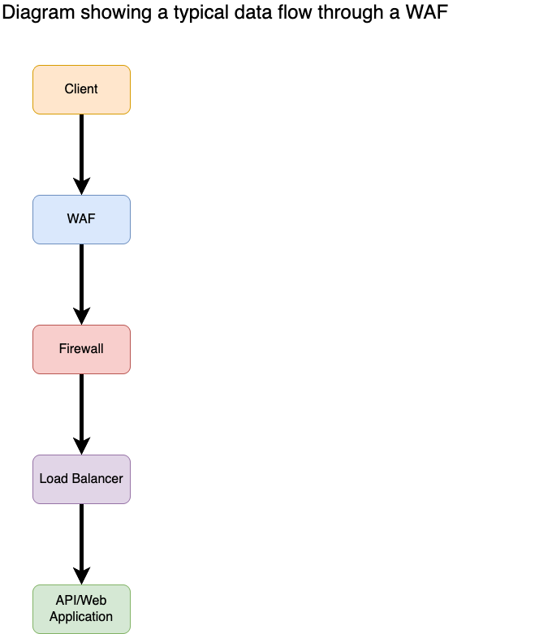

## What this repo is

A collection of practical guides and playbooks for troubleshooting web applications behind WAFs.

Modern web applications span multiple layers:
- WAF (e.g., Imperva CloudWAF)
- Firewalls
- Load balancers / reverse proxies
- Web servers (IIS, NGINX, etc.)
- Application frameworks (Flask, .NET, etc.)

Issues are often attributed to the WAF but originate elsewhere or result from cross-layer misconfigurations.

## What you'll find here

- Articles: Deep dives into real troubleshooting scenarios
- Playbooks: Step-by-step debugging workflows
- Tools: Supporting utilities (e.g., log retrieval)
- Templates: Reusable checklists and workflows
- Examples: Sample logs and data for learning
- AI Guidance: Evidence-driven AI troubleshooting workflows and reusable instruction sets

## Project Status

This repository is actively being developed.

Current focus:
- Intake and evidence collection
- DNS and request-path validation
- WAF visibility verification

Future topics:
- IIS and FREB correlation
- Load balancer troubleshooting
- Flask application troubleshooting
- Header forwarding and TLS issues

## Core principle

**Trace the request across every layer.**

## AI-Assisted Troubleshooting

This repository also includes guidance for using AI systems during WAF and web application troubleshooting.

AI tools can help summarize evidence and accelerate investigations, but they can also reinforce unsupported assumptions when prompts contain incomplete or second-hand information.

The AI guidance in this project focuses on:

- evidence-driven troubleshooting
- authoritative technical sources
- reducing assumption amplification
- structured request-flow validation
- reusable troubleshooting instructions and prompts

The goal is to ensure AI assists troubleshooting methodology rather than replacing technical validation.

→ See: [AI Guidance](ai/README.md)

## Start Here

- [Troubleshooting Methodology](playbooks/00-troubleshooting-methodology.md)

- [Step 01: Intake and Evidence Review](playbooks/01-intake-and-evidence.md)

- [Step 02: Verify the client is pointing to the WAF](playbooks/02-verify-client-points-to-waf.md)
