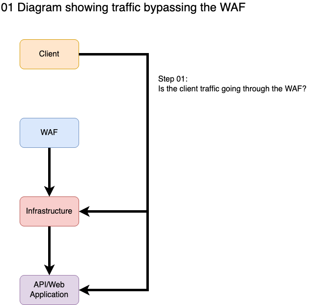

# Step 02: Verify the Client is Pointing to the WAF

## Goal

Confirm the client is resolving to the WAF, not bypassing it.

## Before Troubleshooting

Review the available evidence first.

- [Step 01: Intake and Evidence Review](01-intake-and-evidence.md)
- [Authoritative Sources](../guides/01-intake-and-evidence/authoritative-sources.md)
- [Required Participants](../guides/01-intake-and-evidence/required-participants.md)

## Quick Check: Evidence Already Confirms Client Points to WAF

If the collected evidence already shows that responses are coming from the WAF, skip to [Step 03: Verify the request reaches the WAF](03-verify-request-reaches-waf.md).

**Indicators that evidence already confirms the WAF:**

- Response headers from raw traffic reports show WAF-identifying headers (e.g., `Server`, `X-Frame-Options`, `X-XSS-Protection`, or other WAF-specific headers)
- HAR files clearly show the response is originating from the WAF, not the origin server
- Network traces show the response source IP matches the WAF's known IP range
- The requestor explicitly captured traffic showing the WAF is responding

If this applies to your situation, verification is already complete. Proceed to Step 03.

## What to check

- DNS resolution points to WAF IPs
- No hardcoded IPs in application or client
- No hosts file overrides
- Split DNS is not bypassing the WAF
- Server-to-server traffic is understood and documented
- Rogue or unmanaged APIs are identified

## Preferred Evidence

Strong evidence of WAF traversal may include:

- HAR files
- raw HTTP requests/responses
- WAF response headers
- WAF fingerprints
- matching WAF logs

Supporting evidence may include:

- DNS (`dig`, `nslookup`)
- internal vs external DNS resolution
- hardcoded IP validation
- proxy configuration

## How to verify

- [Step 03: Verify the request reaches the WAF](03-verify-request-reaches-waf.md).
