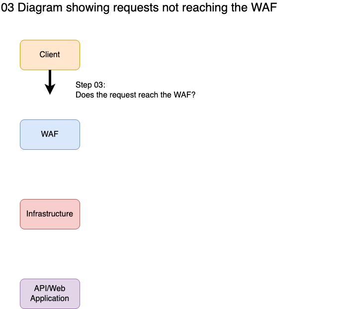

# Step 03: Verify the Request Reaches the WAF

## Goal

Confirm that HTTP requests are reaching the WAF and receiving responses from the WAF, not bypassing it at the network layer.



## Before Troubleshooting

Review the available evidence first.

- [Step 02: Verify the Client is Pointing to the WAF](02-verify-client-points-to-waf.md)
- [Authoritative Sources](../guides/01-intake-and-evidence/authoritative-sources.md)
- [General Verification Guide - Concepts and Tools](../guides/03-verify-request-reaches-waf/general.md)

## Quick Check: Evidence Already Confirms Request Reaches WAF

If the collected evidence already shows responses are coming from the WAF, you can skip to [Step 04: Confirm WAF Handling](04-confirm-waf-handling.md).

**Indicators that evidence already confirms requests reach the WAF:**

- HTTP response headers from HAR files or raw traffic capture show WAF-identifying headers
- Response codes and headers match WAF behavior patterns, not origin server patterns
- WAF access logs or event logs show the request was received and processed
- TLS certificate matches WAF's certificate (not origin server's)

If this applies to your situation, verification is already complete. Proceed to Step 04.

## Verification Approach

To verify requests reach the WAF, test the complete connection flow:

1. **TCP connection** - Establish a TCP connection to the WAF IP and port
2. **TLS handshake** - Negotiate encryption using TLS protocol
3. **HTTP request** - Send HTTP request over the encrypted connection
4. **HTTP response** - Receive HTTP response from the WAF
5. **Response validation** - Examine response for WAF indicators

For detailed information on concepts, tools, and limitations, see [General Verification Guide](../guides/03-verify-request-reaches-waf/general.md).

## Testing by Platform

For detailed commands, options, examples, and interpretation guidance for all tools, see [Platform Tools Guide](../guides/03-verify-request-reaches-waf/platform-tools.md).

### Quick Connectivity Test

**Windows (PowerShell):**
```powershell
Test-NetConnection -ComputerName <WAF_IP> -Port <PORT> -Verbose
```

**Linux/macOS (netcat):**
```bash
nc -zv <WAF_IP> <PORT>
```

These commands test TCP connectivity only. For full HTTP verification, use curl below.

### Full HTTP + TLS Verification

Test the complete connection flow on any platform:

```bash
curl -v https://<WAF_IP>/ -H "Host: <FQDN>"
```

This tests:
- TCP connection to WAF
- TLS handshake with WAF
- HTTP request sent to WAF
- HTTP response received from WAF

For detailed commands, options, and interpretation of output, see [Platform Tools Guide](../guides/03-verify-request-reaches-waf/platform-tools.md).

### External Validation

For validation from outside your network:

- **[SSL Labs SSL Test](https://www.ssllabs.com/ssltest/)** - Validates TLS configuration and certificate
- **[Security Headers](https://securityheaders.com/)** - Analyzes response headers for WAF indicators

For detailed information on using these tools, see [Platform Tools Guide](../guides/03-verify-request-reaches-waf/platform-tools.md).

## Evidence Collection

Strong evidence that requests reach the WAF:

- curl verbose output showing TLS certificate matches WAF
- HTTP response headers contain WAF-identifying headers
- Response status codes or body content match WAF behavior
- WAF access logs or event logs show the request was received
- SSL Labs or Security Headers scan results match WAF configuration

Supporting evidence:

- TCP connectivity confirmed via `Test-NetConnection` or `nc`
- Consistent response times and behavior across multiple tests
- Response headers or cookies are consistent with WAF

For more information on tools and their capabilities, see [General Verification Guide](../guides/03-verify-request-reaches-waf/general.md).

## Troubleshooting When Basic Tests Work But Client Fails

If basic tests (curl, Test-NetConnection, nc) are working but client error messages indicate the client cannot connect to the WAF:

- The issue may be related to older client technology
- The client may not support SNI TLS connections
- The client may not support required TLS protocols or cipher suites

**Only perform these advanced checks if:**

1. Tests from above are working (curl, Test-NetConnection, or nc show successful connections)
2. AND client error messages indicate the client cannot connect to the WAF
3. OR client traffic cannot be found in WAF logs during Step 04

For advanced troubleshooting of legacy clients, including non-SNI TLS connections and protocol/cipher compatibility issues, see [Legacy Clients Troubleshooting Guide](../guides/03-verify-request-reaches-waf/legacy-clients.md).

## Next Step

After confirming requests reach the WAF, proceed to:

[Step 04: Confirm WAF Handling](04-confirm-waf-handling.md)